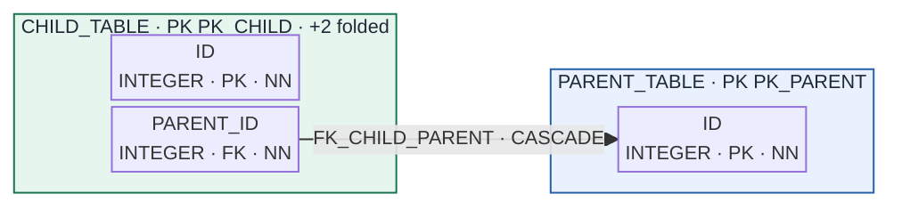
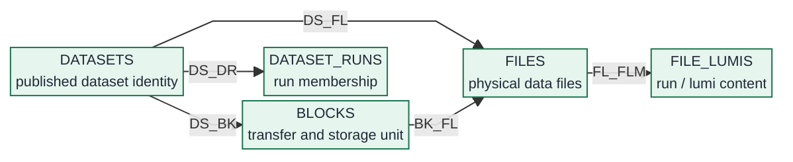
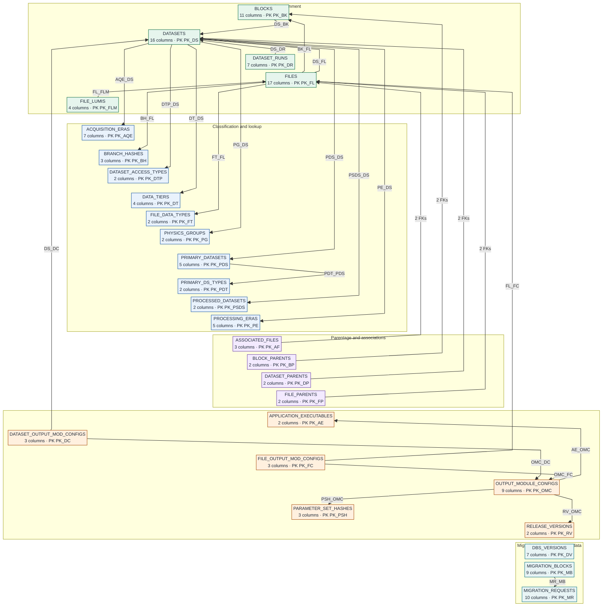
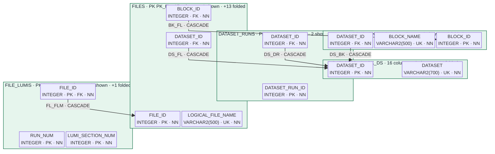
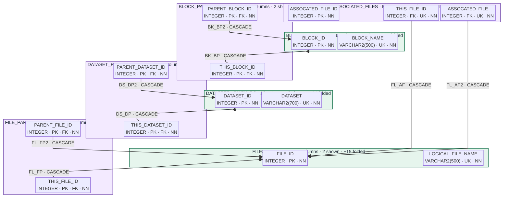
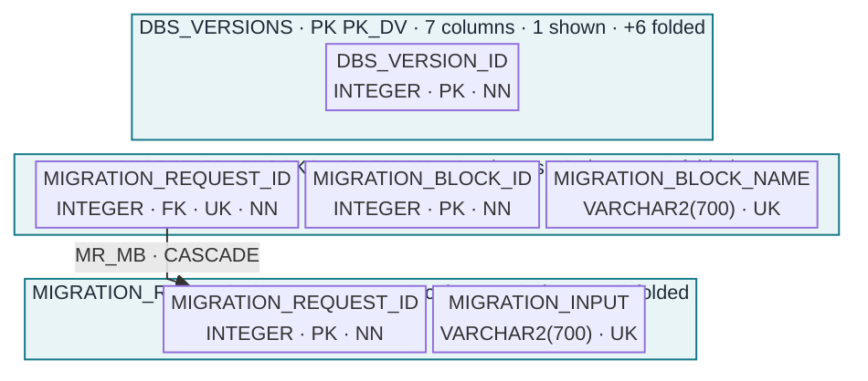

```mermaid
%%{init: {"flowchart": {"nodeSpacing": 4, "rankSpacing": 8, "curve": "linear", "padding": 2}, "themeVariables": {"fontSize": "11px"}}}%%
flowchart TB
  subgraph n_sg_ACQUISITION_ERAS["ACQUISITION_ERAS · PK PK_AQE · 7 columns · 2 shown · +5 folded"]
    direction TB
    n_ACQUISITION_ERAS__ACQUISITION_ERA_ID["ACQUISITION_ERA_ID<br/>INTEGER · PK · NN"]
    n_ACQUISITION_ERAS__ACQUISITION_ERA_NAME["ACQUISITION_ERA_NAME<br/>VARCHAR2(120) · UK · NN"]
  end
  style n_sg_ACQUISITION_ERAS fill:#E9F2FC,stroke:#245FA9,color:#1f2937
  subgraph n_sg_BRANCH_HASHES["BRANCH_HASHES · PK PK_BH · 3 columns · 1 shown · +2 folded"]
    direction TB
    n_BRANCH_HASHES__BRANCH_HASH_ID["BRANCH_HASH_ID<br/>INTEGER · PK · NN"]
  end
  style n_sg_BRANCH_HASHES fill:#E9F2FC,stroke:#245FA9,color:#1f2937
  subgraph n_sg_DATASETS["DATASETS · PK PK_DS · 16 columns · 9 shown · +7 folded"]
    direction TB
    n_DATASETS__DATASET_ID["DATASET_ID<br/>INTEGER · PK · NN"]
    n_DATASETS__DATASET["DATASET<br/>VARCHAR2(700) · UK · NN"]
    n_DATASETS__PRIMARY_DS_ID["PRIMARY_DS_ID<br/>INTEGER · FK · NN"]
    n_DATASETS__PROCESSED_DS_ID["PROCESSED_DS_ID<br/>INTEGER · FK · NN"]
    n_DATASETS__DATA_TIER_ID["DATA_TIER_ID<br/>INTEGER · FK · NN"]
    n_DATASETS__DATASET_ACCESS_TYPE_ID["DATASET_ACCESS_TYPE_ID<br/>INTEGER · FK · NN"]
    n_DATASETS__ACQUISITION_ERA_ID["ACQUISITION_ERA_ID<br/>INTEGER · FK"]
    n_DATASETS__PROCESSING_ERA_ID["PROCESSING_ERA_ID<br/>INTEGER · FK"]
    n_DATASETS__PHYSICS_GROUP_ID["PHYSICS_GROUP_ID<br/>INTEGER · FK"]
  end
  style n_sg_DATASETS fill:#E6F5ED,stroke:#17734D,color:#1f2937
  subgraph n_sg_DATASET_ACCESS_TYPES["DATASET_ACCESS_TYPES · PK PK_DTP · 2 columns · 2 shown"]
    direction TB
    n_DATASET_ACCESS_TYPES__DATASET_ACCESS_TYPE_ID["DATASET_ACCESS_TYPE_ID<br/>INTEGER · PK · NN"]
    n_DATASET_ACCESS_TYPES__DATASET_ACCESS_TYPE["DATASET_ACCESS_TYPE<br/>VARCHAR2(100) · UK · NN"]
  end
  style n_sg_DATASET_ACCESS_TYPES fill:#E9F2FC,stroke:#245FA9,color:#1f2937
  subgraph n_sg_DATA_TIERS["DATA_TIERS · PK PK_DT · 4 columns · 2 shown · +2 folded"]
    direction TB
    n_DATA_TIERS__DATA_TIER_ID["DATA_TIER_ID<br/>INTEGER · PK · NN"]
    n_DATA_TIERS__DATA_TIER_NAME["DATA_TIER_NAME<br/>VARCHAR2(100) · UK · NN"]
  end
  style n_sg_DATA_TIERS fill:#E9F2FC,stroke:#245FA9,color:#1f2937
  subgraph n_sg_FILES["FILES · PK PK_FL · 17 columns · 4 shown · +13 folded"]
    direction TB
    n_FILES__FILE_ID["FILE_ID<br/>INTEGER · PK · NN"]
    n_FILES__LOGICAL_FILE_NAME["LOGICAL_FILE_NAME<br/>VARCHAR2(500) · UK · NN"]
    n_FILES__FILE_TYPE_ID["FILE_TYPE_ID<br/>INTEGER · FK · NN"]
    n_FILES__BRANCH_HASH_ID["BRANCH_HASH_ID<br/>INTEGER · FK"]
  end
  style n_sg_FILES fill:#E6F5ED,stroke:#17734D,color:#1f2937
  subgraph n_sg_FILE_DATA_TYPES["FILE_DATA_TYPES · PK PK_FT · 2 columns · 2 shown"]
    direction TB
    n_FILE_DATA_TYPES__FILE_TYPE_ID["FILE_TYPE_ID<br/>INTEGER · PK · NN"]
    n_FILE_DATA_TYPES__FILE_TYPE["FILE_TYPE<br/>VARCHAR2(100) · UK · NN"]
  end
  style n_sg_FILE_DATA_TYPES fill:#E9F2FC,stroke:#245FA9,color:#1f2937
  subgraph n_sg_PHYSICS_GROUPS["PHYSICS_GROUPS · PK PK_PG · 2 columns · 2 shown"]
    direction TB
    n_PHYSICS_GROUPS__PHYSICS_GROUP_ID["PHYSICS_GROUP_ID<br/>INTEGER · PK · NN"]
    n_PHYSICS_GROUPS__PHYSICS_GROUP_NAME["PHYSICS_GROUP_NAME<br/>VARCHAR2(100) · UK · NN"]
  end
  style n_sg_PHYSICS_GROUPS fill:#E9F2FC,stroke:#245FA9,color:#1f2937
  subgraph n_sg_PRIMARY_DATASETS["PRIMARY_DATASETS · PK PK_PDS · 5 columns · 3 shown · +2 folded"]
    direction TB
    n_PRIMARY_DATASETS__PRIMARY_DS_ID["PRIMARY_DS_ID<br/>INTEGER · PK · NN"]
    n_PRIMARY_DATASETS__PRIMARY_DS_NAME["PRIMARY_DS_NAME<br/>VARCHAR2(100) · UK · NN"]
    n_PRIMARY_DATASETS__PRIMARY_DS_TYPE_ID["PRIMARY_DS_TYPE_ID<br/>INTEGER · FK · NN"]
  end
  style n_sg_PRIMARY_DATASETS fill:#E9F2FC,stroke:#245FA9,color:#1f2937
  subgraph n_sg_PRIMARY_DS_TYPES["PRIMARY_DS_TYPES · PK PK_PDT · 2 columns · 2 shown"]
    direction TB
    n_PRIMARY_DS_TYPES__PRIMARY_DS_TYPE_ID["PRIMARY_DS_TYPE_ID<br/>INTEGER · PK · NN"]
    n_PRIMARY_DS_TYPES__PRIMARY_DS_TYPE["PRIMARY_DS_TYPE<br/>VARCHAR2(100) · UK · NN"]
  end
  style n_sg_PRIMARY_DS_TYPES fill:#E9F2FC,stroke:#245FA9,color:#1f2937
  subgraph n_sg_PROCESSED_DATASETS["PROCESSED_DATASETS · PK PK_PSDS · 2 columns · 2 shown"]
    direction TB
    n_PROCESSED_DATASETS__PROCESSED_DS_ID["PROCESSED_DS_ID<br/>INTEGER · PK · NN"]
    n_PROCESSED_DATASETS__PROCESSED_DS_NAME["PROCESSED_DS_NAME<br/>VARCHAR2(235) · UK · NN"]
  end
  style n_sg_PROCESSED_DATASETS fill:#E9F2FC,stroke:#245FA9,color:#1f2937
  subgraph n_sg_PROCESSING_ERAS["PROCESSING_ERAS · PK PK_PE · 5 columns · 2 shown · +3 folded"]
    direction TB
    n_PROCESSING_ERAS__PROCESSING_ERA_ID["PROCESSING_ERA_ID<br/>INTEGER · PK · NN"]
    n_PROCESSING_ERAS__PROCESSING_VERSION["PROCESSING_VERSION<br/>INTEGER · UK"]
  end
  style n_sg_PROCESSING_ERAS fill:#E9F2FC,stroke:#245FA9,color:#1f2937
  n_sg_ACQUISITION_ERAS ~~~ n_sg_BRANCH_HASHES
  n_sg_BRANCH_HASHES ~~~ n_sg_DATASETS
  n_sg_DATASETS ~~~ n_sg_DATASET_ACCESS_TYPES
  n_sg_DATASET_ACCESS_TYPES ~~~ n_sg_DATA_TIERS
  n_sg_DATA_TIERS ~~~ n_sg_FILES
  n_sg_FILES ~~~ n_sg_FILE_DATA_TYPES
  n_sg_FILE_DATA_TYPES ~~~ n_sg_PHYSICS_GROUPS
  n_sg_PHYSICS_GROUPS ~~~ n_sg_PRIMARY_DATASETS
  n_sg_PRIMARY_DATASETS ~~~ n_sg_PRIMARY_DS_TYPES
  n_sg_PRIMARY_DS_TYPES ~~~ n_sg_PROCESSED_DATASETS
  n_sg_PROCESSED_DATASETS ~~~ n_sg_PROCESSING_ERAS
  n_DATASETS__ACQUISITION_ERA_ID -->|"AQE_DS · SET NULL"| n_ACQUISITION_ERAS__ACQUISITION_ERA_ID
  n_DATASETS__DATASET_ACCESS_TYPE_ID -->|"DTP_DS · NO ACTION"| n_DATASET_ACCESS_TYPES__DATASET_ACCESS_TYPE_ID
  n_DATASETS__DATA_TIER_ID -->|"DT_DS · CASCADE"| n_DATA_TIERS__DATA_TIER_ID
  n_DATASETS__PRIMARY_DS_ID -->|"PDS_DS · CASCADE"| n_PRIMARY_DATASETS__PRIMARY_DS_ID
  n_DATASETS__PROCESSING_ERA_ID -->|"PE_DS · SET NULL"| n_PROCESSING_ERAS__PROCESSING_ERA_ID
  n_DATASETS__PHYSICS_GROUP_ID -->|"PG_DS · SET NULL"| n_PHYSICS_GROUPS__PHYSICS_GROUP_ID
  n_DATASETS__PROCESSED_DS_ID -->|"PSDS_DS · CASCADE"| n_PROCESSED_DATASETS__PROCESSED_DS_ID
  n_FILES__BRANCH_HASH_ID -->|"BH_FL · SET NULL"| n_BRANCH_HASHES__BRANCH_HASH_ID
  n_FILES__FILE_TYPE_ID -->|"FT_FL · NO ACTION"| n_FILE_DATA_TYPES__FILE_TYPE_ID
  n_PRIMARY_DATASETS__PRIMARY_DS_TYPE_ID -->|"PDT_PDS · NO ACTION"| n_PRIMARY_DS_TYPES__PRIMARY_DS_TYPE_ID
```

```mermaid
%%{init: {"flowchart": {"nodeSpacing": 4, "rankSpacing": 8, "curve": "linear", "padding": 2}, "themeVariables": {"fontSize": "11px"}}}%%
flowchart TB
  subgraph n_sg_APPLICATION_EXECUTABLES["APPLICATION_EXECUTABLES · PK PK_AE · 2 columns · 2 shown"]
    direction TB
    n_APPLICATION_EXECUTABLES__APP_EXEC_ID["APP_EXEC_ID<br/>INTEGER · PK · NN"]
    n_APPLICATION_EXECUTABLES__APP_NAME["APP_NAME<br/>VARCHAR2(100) · UK · NN"]
  end
  style n_sg_APPLICATION_EXECUTABLES fill:#FFF0DF,stroke:#AC5516,color:#1f2937
  subgraph n_sg_DATASETS["DATASETS · PK PK_DS · 16 columns · 2 shown · +14 folded"]
    direction TB
    n_DATASETS__DATASET_ID["DATASET_ID<br/>INTEGER · PK · NN"]
    n_DATASETS__DATASET["DATASET<br/>VARCHAR2(700) · UK · NN"]
  end
  style n_sg_DATASETS fill:#E6F5ED,stroke:#17734D,color:#1f2937
  subgraph n_sg_DATASET_OUTPUT_MOD_CONFIGS["DATASET_OUTPUT_MOD_CONFIGS · PK PK_DC · 3 columns · 3 shown"]
    direction TB
    n_DATASET_OUTPUT_MOD_CONFIGS__DS_OUTPUT_MOD_CONF_ID["DS_OUTPUT_MOD_CONF_ID<br/>INTEGER · PK · NN"]
    n_DATASET_OUTPUT_MOD_CONFIGS__DATASET_ID["DATASET_ID<br/>INTEGER · FK · UK · NN"]
    n_DATASET_OUTPUT_MOD_CONFIGS__OUTPUT_MOD_CONFIG_ID["OUTPUT_MOD_CONFIG_ID<br/>INTEGER · FK · UK · NN"]
  end
  style n_sg_DATASET_OUTPUT_MOD_CONFIGS fill:#FFF0DF,stroke:#AC5516,color:#1f2937
  subgraph n_sg_FILES["FILES · PK PK_FL · 17 columns · 2 shown · +15 folded"]
    direction TB
    n_FILES__FILE_ID["FILE_ID<br/>INTEGER · PK · NN"]
    n_FILES__LOGICAL_FILE_NAME["LOGICAL_FILE_NAME<br/>VARCHAR2(500) · UK · NN"]
  end
  style n_sg_FILES fill:#E6F5ED,stroke:#17734D,color:#1f2937
  subgraph n_sg_FILE_OUTPUT_MOD_CONFIGS["FILE_OUTPUT_MOD_CONFIGS · PK PK_FC · 3 columns · 3 shown"]
    direction TB
    n_FILE_OUTPUT_MOD_CONFIGS__FILE_OUTPUT_CONFIG_ID["FILE_OUTPUT_CONFIG_ID<br/>INTEGER · PK · NN"]
    n_FILE_OUTPUT_MOD_CONFIGS__FILE_ID["FILE_ID<br/>INTEGER · FK · UK · NN"]
    n_FILE_OUTPUT_MOD_CONFIGS__OUTPUT_MOD_CONFIG_ID["OUTPUT_MOD_CONFIG_ID<br/>INTEGER · FK · UK · NN"]
  end
  style n_sg_FILE_OUTPUT_MOD_CONFIGS fill:#FFF0DF,stroke:#AC5516,color:#1f2937
  subgraph n_sg_OUTPUT_MODULE_CONFIGS["OUTPUT_MODULE_CONFIGS · PK PK_OMC · 9 columns · 6 shown · +3 folded"]
    direction TB
    n_OUTPUT_MODULE_CONFIGS__OUTPUT_MOD_CONFIG_ID["OUTPUT_MOD_CONFIG_ID<br/>INTEGER · PK · NN"]
    n_OUTPUT_MODULE_CONFIGS__APP_EXEC_ID["APP_EXEC_ID<br/>INTEGER · FK · UK · NN"]
    n_OUTPUT_MODULE_CONFIGS__RELEASE_VERSION_ID["RELEASE_VERSION_ID<br/>INTEGER · FK · UK · NN"]
    n_OUTPUT_MODULE_CONFIGS__PARAMETER_SET_HASH_ID["PARAMETER_SET_HASH_ID<br/>INTEGER · FK · UK · NN"]
    n_OUTPUT_MODULE_CONFIGS__OUTPUT_MODULE_LABEL["OUTPUT_MODULE_LABEL<br/>VARCHAR2(100) · UK · NN"]
    n_OUTPUT_MODULE_CONFIGS__GLOBAL_TAG["GLOBAL_TAG<br/>VARCHAR2(255) · UK · NN"]
  end
  style n_sg_OUTPUT_MODULE_CONFIGS fill:#FFF0DF,stroke:#AC5516,color:#1f2937
  subgraph n_sg_PARAMETER_SET_HASHES["PARAMETER_SET_HASHES · PK PK_PSH · 3 columns · 2 shown · +1 folded"]
    direction TB
    n_PARAMETER_SET_HASHES__PARAMETER_SET_HASH_ID["PARAMETER_SET_HASH_ID<br/>INTEGER · PK · NN"]
    n_PARAMETER_SET_HASHES__PSET_HASH["PSET_HASH<br/>VARCHAR2(128) · UK · NN"]
  end
  style n_sg_PARAMETER_SET_HASHES fill:#FFF0DF,stroke:#AC5516,color:#1f2937
  subgraph n_sg_RELEASE_VERSIONS["RELEASE_VERSIONS · PK PK_RV · 2 columns · 2 shown"]
    direction TB
    n_RELEASE_VERSIONS__RELEASE_VERSION_ID["RELEASE_VERSION_ID<br/>INTEGER · PK · NN"]
    n_RELEASE_VERSIONS__RELEASE_VERSION["RELEASE_VERSION<br/>VARCHAR2(100) · UK · NN"]
  end
  style n_sg_RELEASE_VERSIONS fill:#FFF0DF,stroke:#AC5516,color:#1f2937
  n_sg_APPLICATION_EXECUTABLES ~~~ n_sg_DATASETS
  n_sg_DATASETS ~~~ n_sg_DATASET_OUTPUT_MOD_CONFIGS
  n_sg_DATASET_OUTPUT_MOD_CONFIGS ~~~ n_sg_FILES
  n_sg_FILES ~~~ n_sg_FILE_OUTPUT_MOD_CONFIGS
  n_sg_FILE_OUTPUT_MOD_CONFIGS ~~~ n_sg_OUTPUT_MODULE_CONFIGS
  n_sg_OUTPUT_MODULE_CONFIGS ~~~ n_sg_PARAMETER_SET_HASHES
  n_sg_PARAMETER_SET_HASHES ~~~ n_sg_RELEASE_VERSIONS
  n_DATASET_OUTPUT_MOD_CONFIGS__DATASET_ID -->|"DS_DC · CASCADE"| n_DATASETS__DATASET_ID
  n_DATASET_OUTPUT_MOD_CONFIGS__OUTPUT_MOD_CONFIG_ID -->|"OMC_DC · CASCADE"| n_OUTPUT_MODULE_CONFIGS__OUTPUT_MOD_CONFIG_ID
  n_FILE_OUTPUT_MOD_CONFIGS__FILE_ID -->|"FL_FC · CASCADE"| n_FILES__FILE_ID
  n_FILE_OUTPUT_MOD_CONFIGS__OUTPUT_MOD_CONFIG_ID -->|"OMC_FC · CASCADE"| n_OUTPUT_MODULE_CONFIGS__OUTPUT_MOD_CONFIG_ID
  n_OUTPUT_MODULE_CONFIGS__APP_EXEC_ID -->|"AE_OMC · CASCADE"| n_APPLICATION_EXECUTABLES__APP_EXEC_ID
  n_OUTPUT_MODULE_CONFIGS__PARAMETER_SET_HASH_ID -->|"PSH_OMC · CASCADE"| n_PARAMETER_SET_HASHES__PARAMETER_SET_HASH_ID
  n_OUTPUT_MODULE_CONFIGS__RELEASE_VERSION_ID -->|"RV_OMC · CASCADE"| n_RELEASE_VERSIONS__RELEASE_VERSION_ID
```

# DBS relational data atlas

> Generated from [`create-oracle-schema.sql`](../../static/schema/DDL/create-oracle-schema.sql) (oracle, SHA-256 `3bdef0b189d61348317c9bb5cad254f833e6b2cbb4fa6002acff40c6a6b45163`) with GoSQLX v1.14.0. This is the persisted database structure defined by the DDL, not a live database inventory.

**28 tables · 146 columns · 28 primary keys · 21 unique constraints · 3 checks · 31 foreign keys · 43 explicit indexes**

[Legend](#how-to-read-this-atlas) · [Architecture](#architecture) · [Visualizations](#visualizations) · [Foreign keys](#foreign-key-registry) · [Table dictionary](#table-dictionary) · [Other database objects](#other-database-objects)

## How to read this atlas

A visual table is a labelled container; each inner box is a column. An arrow starts at the referencing (child) column and ends at the referenced key column. The edge label is the foreign-key constraint followed by its delete action.

| Marker | Meaning |
|---|---|
| `PK` | Primary-key column |
| `FK` | Foreign-key source column |
| `UK` | Column participating in a unique constraint (`UQ` in DDL) |
| `NN` | `NOT NULL` |
| `IDX` | Explicit index (distinct from the referenced PK/UK) |
| `IOT` | Oracle index-organized table |
| `DDL` | Data Definition Language source script |

Delete actions: `CASCADE` removes dependent rows; `SET NULL` clears the FK; `NO ACTION` means the DDL has no `ON DELETE` clause.

Functional colors: 🟩 core data · 🟦 classification/lookup · 🟪 parentage · 🟧 processing configuration · 🔷 migration/instance metadata · ⬜ other operational tables.

Database objects: **tables** store rows; **constraints** enforce keys/checks; **indexes** provide access paths; **sequences** generate numeric identifiers; **roles** group privileges; **grants** assign privileges.

## Architecture

The schema has five functional areas. The central structural path is dataset → block → file → luminosity section; lookup tables classify those records, parentage tables link provenance, configuration tables describe producing software, and migration tables record transfers.

## Whole-schema relations

This compact overview shows every table and relationship at table level. Exact column endpoints, constraint names, delete actions, and keys are preserved in the selected maps, registry, and dictionary below.

## Visualizations

The whole-schema graph and five functional areas below use the selected visualization mode. All surrounding documentation is mode-independent.

<strong>Whole-schema relations</strong>

The whole-schema relationship graph rendered with the selected visualization mode.

<strong>Core data and containment</strong>

Datasets, blocks, files, runs, and luminosity sections.

<strong>Classification and lookup</strong>

Dataset identity, eras, tiers, types, physics groups, and branch hashes.

<strong>Parentage and associations</strong>

Dataset, block, and file provenance links.

<strong>Processing configuration</strong>

Applications, releases, parameter sets, and output-module associations.

<strong>Migration and instance metadata</strong>

Migration requests and DBS schema/version metadata.

## Foreign-key registry

The compact registry preserves the constraint, exact endpoints, delete behavior, referenced key, and source-side index.

<strong>Core data and containment</strong> — 5 foreign keys

| FK | Source → referenced endpoint | Delete | Referenced key / source index |
|---|---|---|---|
| `DS_BK` | `BLOCKS.DATASET_ID` → `DATASETS.DATASET_ID` | CASCADE | `PK_DS` index IDX_BK_1 |
| `DS_DR` | `DATASET_RUNS.DATASET_ID` → `DATASETS.DATASET_ID` | CASCADE | `PK_DS` index IDX_DR_1 |
| `BK_FL` | `FILES.BLOCK_ID` → `BLOCKS.BLOCK_ID` | CASCADE | `PK_BK` index IDX_FL_2 |
| `DS_FL` | `FILES.DATASET_ID` → `DATASETS.DATASET_ID` | CASCADE | `PK_DS` index IDX_FL_1 |
| `FL_FLM` | `FILE_LUMIS.FILE_ID` → `FILES.FILE_ID` | CASCADE | `PK_FL` index IDX_FLM_1 |

<strong>Classification and lookup</strong> — 10 foreign keys

| FK | Source → referenced endpoint | Delete | Referenced key / source index |
|---|---|---|---|
| `AQE_DS` | `DATASETS.ACQUISITION_ERA_ID` → `ACQUISITION_ERAS.ACQUISITION_ERA_ID` | SET NULL | `PK_AQE` index IDX_DS_6 |
| `DTP_DS` | `DATASETS.DATASET_ACCESS_TYPE_ID` → `DATASET_ACCESS_TYPES.DATASET_ACCESS_TYPE_ID` | NO ACTION | `PK_DTP` index IDX_DS_4 |
| `DT_DS` | `DATASETS.DATA_TIER_ID` → `DATA_TIERS.DATA_TIER_ID` | CASCADE | `PK_DT` index IDX_DS_2 |
| `PDS_DS` | `DATASETS.PRIMARY_DS_ID` → `PRIMARY_DATASETS.PRIMARY_DS_ID` | CASCADE | `PK_PDS` index IDX_DS_1 |
| `PE_DS` | `DATASETS.PROCESSING_ERA_ID` → `PROCESSING_ERAS.PROCESSING_ERA_ID` | SET NULL | `PK_PE` index IDX_DS_7 |
| `PG_DS` | `DATASETS.PHYSICS_GROUP_ID` → `PHYSICS_GROUPS.PHYSICS_GROUP_ID` | SET NULL | `PK_PG` index IDX_DS_5 |
| `PSDS_DS` | `DATASETS.PROCESSED_DS_ID` → `PROCESSED_DATASETS.PROCESSED_DS_ID` | CASCADE | `PK_PSDS` index IDX_DS_3 |
| `BH_FL` | `FILES.BRANCH_HASH_ID` → `BRANCH_HASHES.BRANCH_HASH_ID` | SET NULL | `PK_BH` index IDX_FL_4 |
| `FT_FL` | `FILES.FILE_TYPE_ID` → `FILE_DATA_TYPES.FILE_TYPE_ID` | NO ACTION | `PK_FT` index IDX_FL_3 |
| `PDT_PDS` | `PRIMARY_DATASETS.PRIMARY_DS_TYPE_ID` → `PRIMARY_DS_TYPES.PRIMARY_DS_TYPE_ID` | NO ACTION | `PK_PDT` index IDX_PDS_1 |

<strong>Parentage and associations</strong> — 8 foreign keys

| FK | Source → referenced endpoint | Delete | Referenced key / source index |
|---|---|---|---|
| `FL_AF` | `ASSOCIATED_FILES.THIS_FILE_ID` → `FILES.FILE_ID` | CASCADE | `PK_FL` index IDX_AF_1 |
| `FL_AF2` | `ASSOCIATED_FILES.ASSOCATED_FILE` → `FILES.FILE_ID` | CASCADE | `PK_FL` index IDX_AF_2 |
| `BK_BP` | `BLOCK_PARENTS.THIS_BLOCK_ID` → `BLOCKS.BLOCK_ID` | CASCADE | `PK_BK` leading columns of PK_BP |
| `BK_BP2` | `BLOCK_PARENTS.PARENT_BLOCK_ID` → `BLOCKS.BLOCK_ID` | CASCADE | `PK_BK` index IDX_BP_1 |
| `DS_DP` | `DATASET_PARENTS.THIS_DATASET_ID` → `DATASETS.DATASET_ID` | CASCADE | `PK_DS` leading columns of PK_DP |
| `DS_DP2` | `DATASET_PARENTS.PARENT_DATASET_ID` → `DATASETS.DATASET_ID` | CASCADE | `PK_DS` index IDX_DP_1 |
| `FL_FP` | `FILE_PARENTS.THIS_FILE_ID` → `FILES.FILE_ID` | CASCADE | `PK_FL` leading columns of PK_FP |
| `FL_FP2` | `FILE_PARENTS.PARENT_FILE_ID` → `FILES.FILE_ID` | CASCADE | `PK_FL` index IDX_FP_1 |

<strong>Processing configuration</strong> — 7 foreign keys

| FK | Source → referenced endpoint | Delete | Referenced key / source index |
|---|---|---|---|
| `DS_DC` | `DATASET_OUTPUT_MOD_CONFIGS.DATASET_ID` → `DATASETS.DATASET_ID` | CASCADE | `PK_DS` index IDX_DC_1 |
| `OMC_DC` | `DATASET_OUTPUT_MOD_CONFIGS.OUTPUT_MOD_CONFIG_ID` → `OUTPUT_MODULE_CONFIGS.OUTPUT_MOD_CONFIG_ID` | CASCADE | `PK_OMC` index IDX_DC_2 |
| `FL_FC` | `FILE_OUTPUT_MOD_CONFIGS.FILE_ID` → `FILES.FILE_ID` | CASCADE | `PK_FL` index IDX_FC_1 |
| `OMC_FC` | `FILE_OUTPUT_MOD_CONFIGS.OUTPUT_MOD_CONFIG_ID` → `OUTPUT_MODULE_CONFIGS.OUTPUT_MOD_CONFIG_ID` | CASCADE | `PK_OMC` index IDX_FC_2 |
| `AE_OMC` | `OUTPUT_MODULE_CONFIGS.APP_EXEC_ID` → `APPLICATION_EXECUTABLES.APP_EXEC_ID` | CASCADE | `PK_AE` index ID_OMC_4 |
| `PSH_OMC` | `OUTPUT_MODULE_CONFIGS.PARAMETER_SET_HASH_ID` → `PARAMETER_SET_HASHES.PARAMETER_SET_HASH_ID` | CASCADE | `PK_PSH` index ID_OMC_2 |
| `RV_OMC` | `OUTPUT_MODULE_CONFIGS.RELEASE_VERSION_ID` → `RELEASE_VERSIONS.RELEASE_VERSION_ID` | CASCADE | `PK_RV` index ID_OMC_1 |

<strong>Migration and instance metadata</strong> — 1 foreign key

| FK | Source → referenced endpoint | Delete | Referenced key / source index |
|---|---|---|---|
| `MR_MB` | `MIGRATION_BLOCKS.MIGRATION_REQUEST_ID` → `MIGRATION_REQUESTS.MIGRATION_REQUEST_ID` | CASCADE | `PK_MR` no matching explicit source index |

## Table dictionary

Every native column, constraint, index, and incoming/outgoing relationship is present. Tables are collapsed by default so the page remains usable.

### Core data and containment

<strong><code>BLOCKS</code></strong> — 11 columns · PK PK_BK · 1 outbound / 3 inbound FKs

Datasets, blocks, files, runs, and luminosity sections.

| Column | Type | Properties |
|---|---|---|
| `BLOCK_ID` | `INTEGER` | `PK` `NN` |
| `BLOCK_NAME` | `VARCHAR2(500)` | `UQ` `NN` |
| `DATASET_ID` | `INTEGER` | `FK` `NN` |
| `OPEN_FOR_WRITING` | `INTEGER` | `NN` default `1` |
| `ORIGIN_SITE_NAME` | `VARCHAR2(200)` | `NN` |
| `BLOCK_SIZE` | `INTEGER` | — |
| `FILE_COUNT` | `INTEGER` | — |
| `CREATION_DATE` | `INTEGER` | — |
| `CREATE_BY` | `VARCHAR2(500)` | — |
| `LAST_MODIFICATION_DATE` | `INTEGER` | — |
| `LAST_MODIFIED_BY` | `VARCHAR2(500)` | — |

**Keys and constraints**

- `PK_BK` **PRIMARY KEY** — `BLOCK_ID`
- `TUC_BK_BLOCK_NAME` **UNIQUE** — `BLOCK_NAME`
- `CC_BK_OPEN_FOR_WRITING` **CHECK** — `OPEN_FOR_WRITING IN (1, 0)`
- `DS_BK` **FOREIGN KEY** — `DATASET_ID → DATASETS(DATASET_ID) · CASCADE`

**Explicit indexes**

- `IDX_BK_1` — `DATASET_ID`
- `ID_BK_2` — `BLOCK_SIZE`
- `ID_BK_3` — `FILE_COUNT`
- `ID_BK_4` — `CREATION_DATE`
- `ID_BK_5` — `CREATE_BY`

**Relationships**

- Outbound `DS_BK`: `DATASET_ID` → `DATASETS.DATASET_ID` (CASCADE)
- Inbound `BK_BP`: `BLOCK_PARENTS.THIS_BLOCK_ID` → `BLOCK_ID`
- Inbound `BK_BP2`: `BLOCK_PARENTS.PARENT_BLOCK_ID` → `BLOCK_ID`
- Inbound `BK_FL`: `FILES.BLOCK_ID` → `BLOCK_ID`

<strong><code>DATASETS</code></strong> — 16 columns · PK PK_DS · 7 outbound / 6 inbound FKs

Datasets, blocks, files, runs, and luminosity sections.

| Column | Type | Properties |
|---|---|---|
| `DATASET_ID` | `INTEGER` | `PK` `NN` |
| `DATASET` | `VARCHAR2(700)` | `UQ` `NN` |
| `IS_DATASET_VALID` | `INTEGER` | `NN` default `1` |
| `PRIMARY_DS_ID` | `INTEGER` | `FK` `NN` |
| `PROCESSED_DS_ID` | `INTEGER` | `FK` `NN` |
| `DATA_TIER_ID` | `INTEGER` | `FK` `NN` |
| `DATASET_ACCESS_TYPE_ID` | `INTEGER` | `FK` `NN` |
| `ACQUISITION_ERA_ID` | `INTEGER` | `FK` |
| `PROCESSING_ERA_ID` | `INTEGER` | `FK` |
| `PHYSICS_GROUP_ID` | `INTEGER` | `FK` |
| `XTCROSSSECTION` | `FLOAT(126)` | — |
| `PREP_ID` | `VARCHAR2(256)` | — |
| `CREATION_DATE` | `INTEGER` | — |
| `CREATE_BY` | `VARCHAR2(500)` | — |
| `LAST_MODIFICATION_DATE` | `INTEGER` | — |
| `LAST_MODIFIED_BY` | `VARCHAR2(500)` | — |

**Keys and constraints**

- `PK_DS` **PRIMARY KEY** — `DATASET_ID`
- `TUC_DS_DATASET` **UNIQUE** — `DATASET`
- `CC_DS_IS_DATASET_VALID` **CHECK** — `IS_DATASET_VALID IN (1, 0)`
- `PDS_DS` **FOREIGN KEY** — `PRIMARY_DS_ID → PRIMARY_DATASETS(PRIMARY_DS_ID) · CASCADE`
- `DT_DS` **FOREIGN KEY** — `DATA_TIER_ID → DATA_TIERS(DATA_TIER_ID) · CASCADE`
- `PSDS_DS` **FOREIGN KEY** — `PROCESSED_DS_ID → PROCESSED_DATASETS(PROCESSED_DS_ID) · CASCADE`
- `DTP_DS` **FOREIGN KEY** — `DATASET_ACCESS_TYPE_ID → DATASET_ACCESS_TYPES(DATASET_ACCESS_TYPE_ID) · NO ACTION`
- `PG_DS` **FOREIGN KEY** — `PHYSICS_GROUP_ID → PHYSICS_GROUPS(PHYSICS_GROUP_ID) · SET NULL`
- `AQE_DS` **FOREIGN KEY** — `ACQUISITION_ERA_ID → ACQUISITION_ERAS(ACQUISITION_ERA_ID) · SET NULL`
- `PE_DS` **FOREIGN KEY** — `PROCESSING_ERA_ID → PROCESSING_ERAS(PROCESSING_ERA_ID) · SET NULL`

**Explicit indexes**

- `IDX_DS_1` — `PRIMARY_DS_ID`
- `IDX_DS_2` — `DATA_TIER_ID`
- `IDX_DS_3` — `PROCESSED_DS_ID`
- `IDX_DS_4` — `DATASET_ACCESS_TYPE_ID`
- `IDX_DS_5` — `PHYSICS_GROUP_ID`
- `IDX_DS_6` — `ACQUISITION_ERA_ID`
- `IDX_DS_7` — `PROCESSING_ERA_ID`
- `ID_DS_8` — `CREATION_DATE`
- `ID_DS_9` — `CREATE_BY`

**Relationships**

- Outbound `AQE_DS`: `ACQUISITION_ERA_ID` → `ACQUISITION_ERAS.ACQUISITION_ERA_ID` (SET NULL)
- Outbound `DTP_DS`: `DATASET_ACCESS_TYPE_ID` → `DATASET_ACCESS_TYPES.DATASET_ACCESS_TYPE_ID` (NO ACTION)
- Outbound `DT_DS`: `DATA_TIER_ID` → `DATA_TIERS.DATA_TIER_ID` (CASCADE)
- Outbound `PDS_DS`: `PRIMARY_DS_ID` → `PRIMARY_DATASETS.PRIMARY_DS_ID` (CASCADE)
- Outbound `PE_DS`: `PROCESSING_ERA_ID` → `PROCESSING_ERAS.PROCESSING_ERA_ID` (SET NULL)
- Outbound `PG_DS`: `PHYSICS_GROUP_ID` → `PHYSICS_GROUPS.PHYSICS_GROUP_ID` (SET NULL)
- Outbound `PSDS_DS`: `PROCESSED_DS_ID` → `PROCESSED_DATASETS.PROCESSED_DS_ID` (CASCADE)
- Inbound `DS_BK`: `BLOCKS.DATASET_ID` → `DATASET_ID`
- Inbound `DS_DC`: `DATASET_OUTPUT_MOD_CONFIGS.DATASET_ID` → `DATASET_ID`
- Inbound `DS_DP`: `DATASET_PARENTS.THIS_DATASET_ID` → `DATASET_ID`
- Inbound `DS_DP2`: `DATASET_PARENTS.PARENT_DATASET_ID` → `DATASET_ID`
- Inbound `DS_DR`: `DATASET_RUNS.DATASET_ID` → `DATASET_ID`
- Inbound `DS_FL`: `FILES.DATASET_ID` → `DATASET_ID`

<strong><code>DATASET_RUNS</code></strong> — 7 columns · PK PK_DR · 1 outbound / 0 inbound FKs

Datasets, blocks, files, runs, and luminosity sections.

| Column | Type | Properties |
|---|---|---|
| `DATASET_RUN_ID` | `INTEGER` | `PK` `NN` |
| `DATASET_ID` | `INTEGER` | `FK` `NN` |
| `RUN_NUMBER` | `INTEGER` | — |
| `COMPLETE` | `INTEGER` | default `0` |
| `LUMI_SECTION_COUNT` | `INTEGER` | — |
| `CREATION_DATE` | `INTEGER` | — |
| `CREATE_BY` | `VARCHAR2(500)` | — |

**Keys and constraints**

- `PK_DR` **PRIMARY KEY** — `DATASET_RUN_ID`
- `DS_DR` **FOREIGN KEY** — `DATASET_ID → DATASETS(DATASET_ID) · CASCADE`

**Explicit indexes**

- `IDX_DR_1` — `DATASET_ID`
- `IDX_DR_2` — `RUN_NUMBER`
- `IDX_DR_3` — `LUMI_SECTION_COUNT`

**Relationships**

- Outbound `DS_DR`: `DATASET_ID` → `DATASETS.DATASET_ID` (CASCADE)

<strong><code>FILES</code></strong> — 17 columns · PK PK_FL · 4 outbound / 6 inbound FKs

Datasets, blocks, files, runs, and luminosity sections.

| Column | Type | Properties |
|---|---|---|
| `FILE_ID` | `INTEGER` | `PK` `NN` |
| `LOGICAL_FILE_NAME` | `VARCHAR2(500)` | `UQ` `NN` |
| `IS_FILE_VALID` | `INTEGER` | `NN` default `1` |
| `DATASET_ID` | `INTEGER` | `FK` `NN` |
| `BLOCK_ID` | `INTEGER` | `FK` `NN` |
| `FILE_TYPE_ID` | `INTEGER` | `FK` `NN` |
| `CHECK_SUM` | `VARCHAR2(100)` | — |
| `EVENT_COUNT` | `INTEGER` | `NN` |
| `FILE_SIZE` | `INTEGER` | `NN` |
| `BRANCH_HASH_ID` | `INTEGER` | `FK` |
| `ADLER32` | `VARCHAR2(100)` | — |
| `MD5` | `VARCHAR2(100)` | — |
| `AUTO_CROSS_SECTION` | `FLOAT(126)` | — |
| `CREATION_DATE` | `INTEGER` | — |
| `CREATE_BY` | `VARCHAR2(500)` | — |
| `LAST_MODIFICATION_DATE` | `INTEGER` | — |
| `LAST_MODIFIED_BY` | `VARCHAR2(500)` | — |

**Keys and constraints**

- `PK_FL` **PRIMARY KEY** — `FILE_ID`
- `TUC_FL_LOGICAL_FILE_NAME` **UNIQUE** — `LOGICAL_FILE_NAME`
- `CC_FL_IS_FILE_VALID` **CHECK** — `IS_FILE_VALID IN (1, 0)`
- `DS_FL` **FOREIGN KEY** — `DATASET_ID → DATASETS(DATASET_ID) · CASCADE`
- `BK_FL` **FOREIGN KEY** — `BLOCK_ID → BLOCKS(BLOCK_ID) · CASCADE`
- `FT_FL` **FOREIGN KEY** — `FILE_TYPE_ID → FILE_DATA_TYPES(FILE_TYPE_ID) · NO ACTION`
- `BH_FL` **FOREIGN KEY** — `BRANCH_HASH_ID → BRANCH_HASHES(BRANCH_HASH_ID) · SET NULL`

**Explicit indexes**

- `IDX_FL_1` — `DATASET_ID`
- `IDX_FL_2` — `BLOCK_ID`
- `IDX_FL_3` — `FILE_TYPE_ID`
- `IDX_FL_4` — `BRANCH_HASH_ID`
- `IDX_FL_5` — `FILE_SIZE`
- `IDX_FL_6` — `CREATION_DATE`
- `IDX_FL_7` — `CREATE_BY`
- `IDX_FL_8` — `IS_FILE_VALID`

**Relationships**

- Outbound `BH_FL`: `BRANCH_HASH_ID` → `BRANCH_HASHES.BRANCH_HASH_ID` (SET NULL)
- Outbound `BK_FL`: `BLOCK_ID` → `BLOCKS.BLOCK_ID` (CASCADE)
- Outbound `DS_FL`: `DATASET_ID` → `DATASETS.DATASET_ID` (CASCADE)
- Outbound `FT_FL`: `FILE_TYPE_ID` → `FILE_DATA_TYPES.FILE_TYPE_ID` (NO ACTION)
- Inbound `FL_AF`: `ASSOCIATED_FILES.THIS_FILE_ID` → `FILE_ID`
- Inbound `FL_AF2`: `ASSOCIATED_FILES.ASSOCATED_FILE` → `FILE_ID`
- Inbound `FL_FLM`: `FILE_LUMIS.FILE_ID` → `FILE_ID`
- Inbound `FL_FC`: `FILE_OUTPUT_MOD_CONFIGS.FILE_ID` → `FILE_ID`
- Inbound `FL_FP`: `FILE_PARENTS.THIS_FILE_ID` → `FILE_ID`
- Inbound `FL_FP2`: `FILE_PARENTS.PARENT_FILE_ID` → `FILE_ID`

<strong><code>FILE_LUMIS</code></strong> — 4 columns · PK PK_FLM · 1 outbound / 0 inbound FKs

Datasets, blocks, files, runs, and luminosity sections.

| Column | Type | Properties |
|---|---|---|
| `RUN_NUM` | `INTEGER` | `PK` `NN` |
| `LUMI_SECTION_NUM` | `INTEGER` | `PK` `NN` |
| `FILE_ID` | `INTEGER` | `PK` `FK` `NN` |
| `EVENT_COUNT` | `INTEGER` | — |

**Keys and constraints**

- `PK_FLM` **PRIMARY KEY** — `RUN_NUM, LUMI_SECTION_NUM, FILE_ID`
- `FL_FLM` **FOREIGN KEY** — `FILE_ID → FILES(FILE_ID) · CASCADE`

**Explicit indexes**

- `IDX_FLM_1` — `FILE_ID`
- `ID_FLM_2` — `RUN_NUM, FILE_ID`

**Relationships**

- Outbound `FL_FLM`: `FILE_ID` → `FILES.FILE_ID` (CASCADE)

### Classification and lookup

<strong><code>ACQUISITION_ERAS</code></strong> — 7 columns · PK PK_AQE · 0 outbound / 1 inbound FKs

Dataset identity, eras, tiers, types, physics groups, and branch hashes.

| Column | Type | Properties |
|---|---|---|
| `ACQUISITION_ERA_ID` | `INTEGER` | `PK` `NN` |
| `ACQUISITION_ERA_NAME` | `VARCHAR2(120)` | `UQ` `NN` |
| `START_DATE` | `INTEGER` | `NN` |
| `END_DATE` | `INTEGER` | — |
| `CREATION_DATE` | `INTEGER` | — |
| `CREATE_BY` | `VARCHAR2(500)` | — |
| `DESCRIPTION` | `VARCHAR2(40)` | — |

**Keys and constraints**

- `PK_AQE` **PRIMARY KEY** — `ACQUISITION_ERA_ID`
- `TUC_AQE_ACQUISITION_ERA_NAME` **UNIQUE** — `ACQUISITION_ERA_NAME`

**Explicit indexes**

- `TUC_AQE_ACQUISITION_ERA_NAME2` **UNIQUE** — `NLSSORT("ACQUISITION_ERA_NAME",'nls_sort=''BINARY_CI''')`

**Relationships**

- Inbound `AQE_DS`: `DATASETS.ACQUISITION_ERA_ID` → `ACQUISITION_ERA_ID`

<strong><code>BRANCH_HASHES</code></strong> — 3 columns · PK PK_BH · 0 outbound / 1 inbound FKs

Dataset identity, eras, tiers, types, physics groups, and branch hashes.

| Column | Type | Properties |
|---|---|---|
| `BRANCH_HASH_ID` | `INTEGER` | `PK` `NN` |
| `BRANCH_HASH` | `VARCHAR2(700)` | `NN` |
| `CONTENT` | `CLOB` | — |

**Keys and constraints**

- `PK_BH` **PRIMARY KEY** — `BRANCH_HASH_ID`

**Relationships**

- Inbound `BH_FL`: `FILES.BRANCH_HASH_ID` → `BRANCH_HASH_ID`

<strong><code>DATASET_ACCESS_TYPES</code></strong> — 2 columns · PK PK_DTP · 0 outbound / 1 inbound FKs

Dataset identity, eras, tiers, types, physics groups, and branch hashes.

| Column | Type | Properties |
|---|---|---|
| `DATASET_ACCESS_TYPE_ID` | `INTEGER` | `PK` `NN` |
| `DATASET_ACCESS_TYPE` | `VARCHAR2(100)` | `UQ` `NN` |

**Keys and constraints**

- `PK_DTP` **PRIMARY KEY** — `DATASET_ACCESS_TYPE_ID`
- `TUC_DTP_DATASET_ACCESS_TYPE` **UNIQUE** — `DATASET_ACCESS_TYPE`

**Relationships**

- Inbound `DTP_DS`: `DATASETS.DATASET_ACCESS_TYPE_ID` → `DATASET_ACCESS_TYPE_ID`

<strong><code>DATA_TIERS</code></strong> — 4 columns · PK PK_DT · 0 outbound / 1 inbound FKs

Dataset identity, eras, tiers, types, physics groups, and branch hashes.

| Column | Type | Properties |
|---|---|---|
| `DATA_TIER_ID` | `INTEGER` | `PK` `NN` |
| `DATA_TIER_NAME` | `VARCHAR2(100)` | `UQ` `NN` |
| `CREATION_DATE` | `INTEGER` | — |
| `CREATE_BY` | `VARCHAR2(500)` | — |

**Keys and constraints**

- `PK_DT` **PRIMARY KEY** — `DATA_TIER_ID`
- `TUC_DT_DATA_TIER_NAME` **UNIQUE** — `DATA_TIER_NAME`

**Relationships**

- Inbound `DT_DS`: `DATASETS.DATA_TIER_ID` → `DATA_TIER_ID`

<strong><code>FILE_DATA_TYPES</code></strong> — 2 columns · PK PK_FT · 0 outbound / 1 inbound FKs

Dataset identity, eras, tiers, types, physics groups, and branch hashes.

| Column | Type | Properties |
|---|---|---|
| `FILE_TYPE_ID` | `INTEGER` | `PK` `NN` |
| `FILE_TYPE` | `VARCHAR2(100)` | `UQ` `NN` |

**Keys and constraints**

- `PK_FT` **PRIMARY KEY** — `FILE_TYPE_ID`
- `TUC_FT_FILE_TYPE` **UNIQUE** — `FILE_TYPE`

**Relationships**

- Inbound `FT_FL`: `FILES.FILE_TYPE_ID` → `FILE_TYPE_ID`

<strong><code>PHYSICS_GROUPS</code></strong> — 2 columns · PK PK_PG · 0 outbound / 1 inbound FKs

Dataset identity, eras, tiers, types, physics groups, and branch hashes.

| Column | Type | Properties |
|---|---|---|
| `PHYSICS_GROUP_ID` | `INTEGER` | `PK` `NN` |
| `PHYSICS_GROUP_NAME` | `VARCHAR2(100)` | `UQ` `NN` |

**Keys and constraints**

- `PK_PG` **PRIMARY KEY** — `PHYSICS_GROUP_ID`
- `TUC_PG_PHYSICS_GROUP_NAME` **UNIQUE** — `PHYSICS_GROUP_NAME`

**Relationships**

- Inbound `PG_DS`: `DATASETS.PHYSICS_GROUP_ID` → `PHYSICS_GROUP_ID`

<strong><code>PRIMARY_DATASETS</code></strong> — 5 columns · PK PK_PDS · 1 outbound / 1 inbound FKs

Dataset identity, eras, tiers, types, physics groups, and branch hashes.

| Column | Type | Properties |
|---|---|---|
| `PRIMARY_DS_ID` | `INTEGER` | `PK` `NN` |
| `PRIMARY_DS_NAME` | `VARCHAR2(100)` | `UQ` `NN` |
| `PRIMARY_DS_TYPE_ID` | `INTEGER` | `FK` `NN` |
| `CREATION_DATE` | `INTEGER` | — |
| `CREATE_BY` | `VARCHAR2(500)` | — |

**Keys and constraints**

- `PK_PDS` **PRIMARY KEY** — `PRIMARY_DS_ID`
- `TUC_PDS_PRIMARY_DS_NAME` **UNIQUE** — `PRIMARY_DS_NAME`
- `PDT_PDS` **FOREIGN KEY** — `PRIMARY_DS_TYPE_ID → PRIMARY_DS_TYPES(PRIMARY_DS_TYPE_ID) · NO ACTION`

**Explicit indexes**

- `IDX_PDS_1` — `PRIMARY_DS_TYPE_ID`

**Relationships**

- Outbound `PDT_PDS`: `PRIMARY_DS_TYPE_ID` → `PRIMARY_DS_TYPES.PRIMARY_DS_TYPE_ID` (NO ACTION)
- Inbound `PDS_DS`: `DATASETS.PRIMARY_DS_ID` → `PRIMARY_DS_ID`

<strong><code>PRIMARY_DS_TYPES</code></strong> — 2 columns · PK PK_PDT · 0 outbound / 1 inbound FKs

Dataset identity, eras, tiers, types, physics groups, and branch hashes.

| Column | Type | Properties |
|---|---|---|
| `PRIMARY_DS_TYPE_ID` | `INTEGER` | `PK` `NN` |
| `PRIMARY_DS_TYPE` | `VARCHAR2(100)` | `UQ` `NN` |

**Keys and constraints**

- `PK_PDT` **PRIMARY KEY** — `PRIMARY_DS_TYPE_ID`
- `TUC_PDT_PRIMARY_DS_TYPE` **UNIQUE** — `PRIMARY_DS_TYPE`

**Relationships**

- Inbound `PDT_PDS`: `PRIMARY_DATASETS.PRIMARY_DS_TYPE_ID` → `PRIMARY_DS_TYPE_ID`

<strong><code>PROCESSED_DATASETS</code></strong> — 2 columns · PK PK_PSDS · 0 outbound / 1 inbound FKs

Dataset identity, eras, tiers, types, physics groups, and branch hashes.

| Column | Type | Properties |
|---|---|---|
| `PROCESSED_DS_ID` | `INTEGER` | `PK` `NN` |
| `PROCESSED_DS_NAME` | `VARCHAR2(235)` | `UQ` `NN` |

**Keys and constraints**

- `PK_PSDS` **PRIMARY KEY** — `PROCESSED_DS_ID`
- `TUC_PSDS_PROCESSED_DS_NAME` **UNIQUE** — `PROCESSED_DS_NAME`

**Relationships**

- Inbound `PSDS_DS`: `DATASETS.PROCESSED_DS_ID` → `PROCESSED_DS_ID`

<strong><code>PROCESSING_ERAS</code></strong> — 5 columns · PK PK_PE · 0 outbound / 1 inbound FKs

Dataset identity, eras, tiers, types, physics groups, and branch hashes.

| Column | Type | Properties |
|---|---|---|
| `PROCESSING_ERA_ID` | `INTEGER` | `PK` `NN` |
| `PROCESSING_VERSION` | `INTEGER` | `UQ` |
| `CREATION_DATE` | `INTEGER` | — |
| `CREATE_BY` | `VARCHAR2(500)` | — |
| `DESCRIPTION` | `VARCHAR2(40)` | — |

**Keys and constraints**

- `PK_PE` **PRIMARY KEY** — `PROCESSING_ERA_ID`
- `TUC_PE_PROCESSING_VERSION` **UNIQUE** — `PROCESSING_VERSION`

**Relationships**

- Inbound `PE_DS`: `DATASETS.PROCESSING_ERA_ID` → `PROCESSING_ERA_ID`

### Parentage and associations

<strong><code>ASSOCIATED_FILES</code></strong> — 3 columns · PK PK_AF · 2 outbound / 0 inbound FKs

Dataset, block, and file provenance links.

| Column | Type | Properties |
|---|---|---|
| `ASSOCATED_FILE_ID` | `INTEGER` | `PK` `NN` |
| `THIS_FILE_ID` | `INTEGER` | `FK` `UQ` `NN` |
| `ASSOCATED_FILE` | `INTEGER` | `FK` `UQ` `NN` |

**Keys and constraints**

- `PK_AF` **PRIMARY KEY** — `ASSOCATED_FILE_ID`
- `TUC_AF_1` **UNIQUE** — `THIS_FILE_ID, ASSOCATED_FILE`
- `FL_AF` **FOREIGN KEY** — `THIS_FILE_ID → FILES(FILE_ID) · CASCADE`
- `FL_AF2` **FOREIGN KEY** — `ASSOCATED_FILE → FILES(FILE_ID) · CASCADE`

**Explicit indexes**

- `IDX_AF_1` — `THIS_FILE_ID`
- `IDX_AF_2` — `ASSOCATED_FILE`

**Relationships**

- Outbound `FL_AF`: `THIS_FILE_ID` → `FILES.FILE_ID` (CASCADE)
- Outbound `FL_AF2`: `ASSOCATED_FILE` → `FILES.FILE_ID` (CASCADE)

<strong><code>BLOCK_PARENTS</code></strong> — 2 columns · PK PK_BP · 2 outbound / 0 inbound FKs

Dataset, block, and file provenance links.

| Column | Type | Properties |
|---|---|---|
| `THIS_BLOCK_ID` | `INTEGER` | `PK` `FK` `NN` |
| `PARENT_BLOCK_ID` | `INTEGER` | `PK` `FK` `NN` |

**Keys and constraints**

- `PK_BP` **PRIMARY KEY** — `THIS_BLOCK_ID, PARENT_BLOCK_ID`
- `BK_BP` **FOREIGN KEY** — `THIS_BLOCK_ID → BLOCKS(BLOCK_ID) · CASCADE`
- `BK_BP2` **FOREIGN KEY** — `PARENT_BLOCK_ID → BLOCKS(BLOCK_ID) · CASCADE`

**Explicit indexes**

- `IDX_BP_1` — `PARENT_BLOCK_ID`

**Relationships**

- Outbound `BK_BP`: `THIS_BLOCK_ID` → `BLOCKS.BLOCK_ID` (CASCADE)
- Outbound `BK_BP2`: `PARENT_BLOCK_ID` → `BLOCKS.BLOCK_ID` (CASCADE)

Storage organization: `INDEX`.

<strong><code>DATASET_PARENTS</code></strong> — 2 columns · PK PK_DP · 2 outbound / 0 inbound FKs

Dataset, block, and file provenance links.

| Column | Type | Properties |
|---|---|---|
| `THIS_DATASET_ID` | `INTEGER` | `PK` `FK` `NN` |
| `PARENT_DATASET_ID` | `INTEGER` | `PK` `FK` `NN` |

**Keys and constraints**

- `PK_DP` **PRIMARY KEY** — `THIS_DATASET_ID, PARENT_DATASET_ID`
- `DS_DP` **FOREIGN KEY** — `THIS_DATASET_ID → DATASETS(DATASET_ID) · CASCADE`
- `DS_DP2` **FOREIGN KEY** — `PARENT_DATASET_ID → DATASETS(DATASET_ID) · CASCADE`

**Explicit indexes**

- `IDX_DP_1` — `PARENT_DATASET_ID`

**Relationships**

- Outbound `DS_DP`: `THIS_DATASET_ID` → `DATASETS.DATASET_ID` (CASCADE)
- Outbound `DS_DP2`: `PARENT_DATASET_ID` → `DATASETS.DATASET_ID` (CASCADE)

Storage organization: `INDEX`.

<strong><code>FILE_PARENTS</code></strong> — 2 columns · PK PK_FP · 2 outbound / 0 inbound FKs

Dataset, block, and file provenance links.

| Column | Type | Properties |
|---|---|---|
| `THIS_FILE_ID` | `INTEGER` | `PK` `FK` `NN` |
| `PARENT_FILE_ID` | `INTEGER` | `PK` `FK` `NN` |

**Keys and constraints**

- `PK_FP` **PRIMARY KEY** — `THIS_FILE_ID, PARENT_FILE_ID`
- `FL_FP` **FOREIGN KEY** — `THIS_FILE_ID → FILES(FILE_ID) · CASCADE`
- `FL_FP2` **FOREIGN KEY** — `PARENT_FILE_ID → FILES(FILE_ID) · CASCADE`

**Explicit indexes**

- `IDX_FP_1` — `PARENT_FILE_ID`

**Relationships**

- Outbound `FL_FP`: `THIS_FILE_ID` → `FILES.FILE_ID` (CASCADE)
- Outbound `FL_FP2`: `PARENT_FILE_ID` → `FILES.FILE_ID` (CASCADE)

Storage organization: `INDEX`.

### Processing configuration

<strong><code>APPLICATION_EXECUTABLES</code></strong> — 2 columns · PK PK_AE · 0 outbound / 1 inbound FKs

Applications, releases, parameter sets, and output-module associations.

| Column | Type | Properties |
|---|---|---|
| `APP_EXEC_ID` | `INTEGER` | `PK` `NN` |
| `APP_NAME` | `VARCHAR2(100)` | `UQ` `NN` |

**Keys and constraints**

- `PK_AE` **PRIMARY KEY** — `APP_EXEC_ID`
- `TUC_AE_APP_NAME` **UNIQUE** — `APP_NAME`

**Relationships**

- Inbound `AE_OMC`: `OUTPUT_MODULE_CONFIGS.APP_EXEC_ID` → `APP_EXEC_ID`

<strong><code>DATASET_OUTPUT_MOD_CONFIGS</code></strong> — 3 columns · PK PK_DC · 2 outbound / 0 inbound FKs

Applications, releases, parameter sets, and output-module associations.

| Column | Type | Properties |
|---|---|---|
| `DS_OUTPUT_MOD_CONF_ID` | `INTEGER` | `PK` `NN` |
| `DATASET_ID` | `INTEGER` | `FK` `UQ` `NN` |
| `OUTPUT_MOD_CONFIG_ID` | `INTEGER` | `FK` `UQ` `NN` |

**Keys and constraints**

- `PK_DC` **PRIMARY KEY** — `DS_OUTPUT_MOD_CONF_ID`
- `TUC_DC_1` **UNIQUE** — `DATASET_ID, OUTPUT_MOD_CONFIG_ID`
- `DS_DC` **FOREIGN KEY** — `DATASET_ID → DATASETS(DATASET_ID) · CASCADE`
- `OMC_DC` **FOREIGN KEY** — `OUTPUT_MOD_CONFIG_ID → OUTPUT_MODULE_CONFIGS(OUTPUT_MOD_CONFIG_ID) · CASCADE`

**Explicit indexes**

- `IDX_DC_1` — `DATASET_ID`
- `IDX_DC_2` — `OUTPUT_MOD_CONFIG_ID`

**Relationships**

- Outbound `DS_DC`: `DATASET_ID` → `DATASETS.DATASET_ID` (CASCADE)
- Outbound `OMC_DC`: `OUTPUT_MOD_CONFIG_ID` → `OUTPUT_MODULE_CONFIGS.OUTPUT_MOD_CONFIG_ID` (CASCADE)

<strong><code>FILE_OUTPUT_MOD_CONFIGS</code></strong> — 3 columns · PK PK_FC · 2 outbound / 0 inbound FKs

Applications, releases, parameter sets, and output-module associations.

| Column | Type | Properties |
|---|---|---|
| `FILE_OUTPUT_CONFIG_ID` | `INTEGER` | `PK` `NN` |
| `FILE_ID` | `INTEGER` | `FK` `UQ` `NN` |
| `OUTPUT_MOD_CONFIG_ID` | `INTEGER` | `FK` `UQ` `NN` |

**Keys and constraints**

- `PK_FC` **PRIMARY KEY** — `FILE_OUTPUT_CONFIG_ID`
- `TUC_FC_1` **UNIQUE** — `FILE_ID, OUTPUT_MOD_CONFIG_ID`
- `FL_FC` **FOREIGN KEY** — `FILE_ID → FILES(FILE_ID) · CASCADE`
- `OMC_FC` **FOREIGN KEY** — `OUTPUT_MOD_CONFIG_ID → OUTPUT_MODULE_CONFIGS(OUTPUT_MOD_CONFIG_ID) · CASCADE`

**Explicit indexes**

- `IDX_FC_1` — `FILE_ID`
- `IDX_FC_2` — `OUTPUT_MOD_CONFIG_ID`

**Relationships**

- Outbound `FL_FC`: `FILE_ID` → `FILES.FILE_ID` (CASCADE)
- Outbound `OMC_FC`: `OUTPUT_MOD_CONFIG_ID` → `OUTPUT_MODULE_CONFIGS.OUTPUT_MOD_CONFIG_ID` (CASCADE)

<strong><code>OUTPUT_MODULE_CONFIGS</code></strong> — 9 columns · PK PK_OMC · 3 outbound / 2 inbound FKs

Applications, releases, parameter sets, and output-module associations.

| Column | Type | Properties |
|---|---|---|
| `OUTPUT_MOD_CONFIG_ID` | `INTEGER` | `PK` `NN` |
| `APP_EXEC_ID` | `INTEGER` | `FK` `UQ` `NN` |
| `RELEASE_VERSION_ID` | `INTEGER` | `FK` `UQ` `NN` |
| `PARAMETER_SET_HASH_ID` | `INTEGER` | `FK` `UQ` `NN` |
| `OUTPUT_MODULE_LABEL` | `VARCHAR2(100)` | `UQ` `NN` default `'NONE'` |
| `GLOBAL_TAG` | `VARCHAR2(255)` | `UQ` `NN` |
| `SCENARIO` | `VARCHAR2(40)` | — |
| `CREATION_DATE` | `INTEGER` | — |
| `CREATE_BY` | `VARCHAR2(500)` | — |

**Keys and constraints**

- `PK_OMC` **PRIMARY KEY** — `OUTPUT_MOD_CONFIG_ID`
- `TUC_OMC_1` **UNIQUE** — `APP_EXEC_ID, RELEASE_VERSION_ID, PARAMETER_SET_HASH_ID, OUTPUT_MODULE_LABEL, GLOBAL_TAG`
- `AE_OMC` **FOREIGN KEY** — `APP_EXEC_ID → APPLICATION_EXECUTABLES(APP_EXEC_ID) · CASCADE`
- `RV_OMC` **FOREIGN KEY** — `RELEASE_VERSION_ID → RELEASE_VERSIONS(RELEASE_VERSION_ID) · CASCADE`
- `PSH_OMC` **FOREIGN KEY** — `PARAMETER_SET_HASH_ID → PARAMETER_SET_HASHES(PARAMETER_SET_HASH_ID) · CASCADE`

**Explicit indexes**

- `ID_OMC_1` — `RELEASE_VERSION_ID`
- `ID_OMC_2` — `PARAMETER_SET_HASH_ID`
- `ID_OMC_3` — `OUTPUT_MODULE_LABEL`
- `ID_OMC_4` — `APP_EXEC_ID`

**Relationships**

- Outbound `AE_OMC`: `APP_EXEC_ID` → `APPLICATION_EXECUTABLES.APP_EXEC_ID` (CASCADE)
- Outbound `PSH_OMC`: `PARAMETER_SET_HASH_ID` → `PARAMETER_SET_HASHES.PARAMETER_SET_HASH_ID` (CASCADE)
- Outbound `RV_OMC`: `RELEASE_VERSION_ID` → `RELEASE_VERSIONS.RELEASE_VERSION_ID` (CASCADE)
- Inbound `OMC_DC`: `DATASET_OUTPUT_MOD_CONFIGS.OUTPUT_MOD_CONFIG_ID` → `OUTPUT_MOD_CONFIG_ID`
- Inbound `OMC_FC`: `FILE_OUTPUT_MOD_CONFIGS.OUTPUT_MOD_CONFIG_ID` → `OUTPUT_MOD_CONFIG_ID`

<strong><code>PARAMETER_SET_HASHES</code></strong> — 3 columns · PK PK_PSH · 0 outbound / 1 inbound FKs

Applications, releases, parameter sets, and output-module associations.

| Column | Type | Properties |
|---|---|---|
| `PARAMETER_SET_HASH_ID` | `INTEGER` | `PK` `NN` |
| `PSET_HASH` | `VARCHAR2(128)` | `UQ` `NN` |
| `PSET_NAME` | `VARCHAR2(135)` | — |

**Keys and constraints**

- `PK_PSH` **PRIMARY KEY** — `PARAMETER_SET_HASH_ID`
- `TUC_PSH_PSET_HASH` **UNIQUE** — `PSET_HASH`

**Explicit indexes**

- `IDX_PSH_1` — `PSET_NAME`

**Relationships**

- Inbound `PSH_OMC`: `OUTPUT_MODULE_CONFIGS.PARAMETER_SET_HASH_ID` → `PARAMETER_SET_HASH_ID`

<strong><code>RELEASE_VERSIONS</code></strong> — 2 columns · PK PK_RV · 0 outbound / 1 inbound FKs

Applications, releases, parameter sets, and output-module associations.

| Column | Type | Properties |
|---|---|---|
| `RELEASE_VERSION_ID` | `INTEGER` | `PK` `NN` |
| `RELEASE_VERSION` | `VARCHAR2(100)` | `UQ` `NN` |

**Keys and constraints**

- `PK_RV` **PRIMARY KEY** — `RELEASE_VERSION_ID`
- `TUC_RV_RELEASE_VERSION` **UNIQUE** — `RELEASE_VERSION`

**Relationships**

- Inbound `RV_OMC`: `OUTPUT_MODULE_CONFIGS.RELEASE_VERSION_ID` → `RELEASE_VERSION_ID`

### Migration and instance metadata

<strong><code>DBS_VERSIONS</code></strong> — 7 columns · PK PK_DV · 0 outbound / 0 inbound FKs

Migration requests and DBS schema/version metadata.

| Column | Type | Properties |
|---|---|---|
| `DBS_VERSION_ID` | `INTEGER` | `PK` `NN` |
| `SCHEMA_VERSION` | `VARCHAR2(40)` | `NN` |
| `DBS_RELEASE_VERSION` | `VARCHAR2(40)` | `NN` |
| `INSTANCE_NAME` | `VARCHAR2(40)` | `NN` |
| `INSTANCE_TYPE` | `VARCHAR2(40)` | `NN` |
| `CREATION_DATE` | `INTEGER` | — |
| `LAST_MODIFICATION_DATE` | `INTEGER` | — |

**Keys and constraints**

- `PK_DV` **PRIMARY KEY** — `DBS_VERSION_ID`

<strong><code>MIGRATION_BLOCKS</code></strong> — 9 columns · PK PK_MB · 1 outbound / 0 inbound FKs

Migration requests and DBS schema/version metadata.

| Column | Type | Properties |
|---|---|---|
| `MIGRATION_BLOCK_ID` | `INTEGER` | `PK` `NN` |
| `MIGRATION_REQUEST_ID` | `INTEGER` | `FK` `UQ` `NN` |
| `MIGRATION_BLOCK_NAME` | `VARCHAR2(700)` | `UQ` |
| `MIGRATION_ORDER` | `INTEGER` | — |
| `MIGRATION_STATUS` | `INTEGER` | — |
| `CREATION_DATE` | `INTEGER` | — |
| `CREATE_BY` | `VARCHAR2(500)` | — |
| `LAST_MODIFICATION_DATE` | `INTEGER` | — |
| `LAST_MODIFIED_BY` | `VARCHAR2(500)` | — |

**Keys and constraints**

- `PK_MB` **PRIMARY KEY** — `MIGRATION_BLOCK_ID`
- `TUC_MB_1` **UNIQUE** — `MIGRATION_BLOCK_NAME, MIGRATION_REQUEST_ID`
- `MR_MB` **FOREIGN KEY** — `MIGRATION_REQUEST_ID → MIGRATION_REQUESTS(MIGRATION_REQUEST_ID) · CASCADE`

**Relationships**

- Outbound `MR_MB`: `MIGRATION_REQUEST_ID` → `MIGRATION_REQUESTS.MIGRATION_REQUEST_ID` (CASCADE)

<strong><code>MIGRATION_REQUESTS</code></strong> — 10 columns · PK PK_MR · 0 outbound / 1 inbound FKs

Migration requests and DBS schema/version metadata.

| Column | Type | Properties |
|---|---|---|
| `MIGRATION_REQUEST_ID` | `INTEGER` | `PK` `NN` |
| `MIGRATION_URL` | `VARCHAR2(300)` | — |
| `MIGRATION_INPUT` | `VARCHAR2(700)` | `UQ` |
| `MIGRATION_STATUS` | `INTEGER` | — |
| `MIGRATION_SERVER` | `VARCHAR2(100)` | — |
| `CREATION_DATE` | `INTEGER` | — |
| `CREATE_BY` | `VARCHAR2(500)` | — |
| `LAST_MODIFICATION_DATE` | `INTEGER` | — |
| `LAST_MODIFIED_BY` | `VARCHAR2(500)` | — |
| `RETRY_COUNT` | `INTEGER` | — |

**Keys and constraints**

- `PK_MR` **PRIMARY KEY** — `MIGRATION_REQUEST_ID`
- `TUC_MR_1` **UNIQUE** — `MIGRATION_INPUT`

**Relationships**

- Inbound `MR_MB`: `MIGRATION_BLOCKS.MIGRATION_REQUEST_ID` → `MIGRATION_REQUEST_ID`

## Other database objects

These statements are outside the relational table graph but remain part of the source DDL. They are preserved instead of being reported as parser failures.

<strong>Create Sequence</strong> — 33 statements

- Line 131: `CREATE SEQUENCE SEQ_AE START WITH 1 INCREMENT BY 1 NOMINVALUE NOMAXVALUE nocycle CACHE 5000 noorder`
- Line 248: `CREATE SEQUENCE SEQ_AF START WITH 1 INCREMENT BY 120 NOMINVALUE NOMAXVALUE nocycle CACHE 5000 noorder`
- Line 158: `CREATE SEQUENCE SEQ_AQE START WITH 1 INCREMENT BY 1 NOMINVALUE NOMAXVALUE nocycle CACHE 5000 noorder`
- Line 257: `CREATE SEQUENCE SEQ_BH START WITH 1 INCREMENT BY 1 NOMINVALUE NOMAXVALUE nocycle CACHE 5000 noorder`
- Line 185: `CREATE SEQUENCE SEQ_BK START WITH 1 INCREMENT BY 1 NOMINVALUE NOMAXVALUE nocycle CACHE 5000 noorder`
- Line 284: `CREATE SEQUENCE SEQ_BLST START WITH 1 INCREMENT BY 1 NOMINVALUE NOMAXVALUE nocycle CACHE 5000 noorder`
- Line 140: `CREATE SEQUENCE SEQ_BP START WITH 1 INCREMENT BY 1 NOMINVALUE NOMAXVALUE nocycle CACHE 5000 noorder`
- Line 212: `CREATE SEQUENCE SEQ_BSE START WITH 1 INCREMENT BY 1 NOMINVALUE NOMAXVALUE nocycle CACHE 5000 noorder`
- Line 311: `CREATE SEQUENCE SEQ_CS START WITH 1 INCREMENT BY 1 NOMINVALUE NOMAXVALUE nocycle CACHE 5000 noorder`
- Line 95: `CREATE SEQUENCE SEQ_DC START WITH 1 INCREMENT BY 1 NOMINVALUE NOMAXVALUE nocycle CACHE 5000 noorder`
- Line 104: `CREATE SEQUENCE SEQ_DP START WITH 1 INCREMENT BY 1 NOMINVALUE NOMAXVALUE nocycle CACHE 5000 noorder`
- Line 41: `CREATE SEQUENCE SEQ_DR START WITH 1 INCREMENT BY 1 NOMINVALUE NOMAXVALUE nocycle CACHE 5000 noorder`
- Line 122: `CREATE SEQUENCE SEQ_DS START WITH 1 INCREMENT BY 1 NOMINVALUE NOMAXVALUE nocycle CACHE 5000 noorder`
- Line 59: `CREATE SEQUENCE SEQ_DT START WITH 100 INCREMENT BY 1 NOMINVALUE NOMAXVALUE nocycle CACHE 5000 noorder`
- Line 113: `CREATE SEQUENCE SEQ_DTP START WITH 100 INCREMENT BY 1 NOMINVALUE NOMAXVALUE nocycle CACHE 5000 noorder`
- Line 275: `CREATE SEQUENCE SEQ_DV START WITH 100 INCREMENT BY 1 NOMINVALUE NOMAXVALUE nocycle CACHE 5000 noorder`
- Line 266: `CREATE SEQUENCE SEQ_FC START WITH 1 INCREMENT BY 1 NOMINVALUE NOMAXVALUE nocycle CACHE 5000 noorder`
- Line 221: `CREATE SEQUENCE SEQ_FL START WITH 1 INCREMENT BY 40 NOMINVALUE NOMAXVALUE nocycle CACHE 5000 noorder`
- Line 176: `CREATE SEQUENCE SEQ_FLM START WITH 1 INCREMENT BY 1000 NOMINVALUE NOMAXVALUE nocycle CACHE 5000 noorder`
- Line 230: `CREATE SEQUENCE SEQ_FP START WITH 1 INCREMENT BY 120 NOMINVALUE NOMAXVALUE nocycle CACHE 5000 noorder`
- Line 239: `CREATE SEQUENCE SEQ_FT START WITH 100 INCREMENT BY 1 NOMINVALUE NOMAXVALUE nocycle CACHE 5000 noorder`
- Line 293: `CREATE SEQUENCE SEQ_MB START WITH 1 INCREMENT BY 1 NOMINVALUE NOMAXVALUE nocycle CACHE 5000 noorder`
- Line 302: `CREATE SEQUENCE SEQ_MR START WITH 1 INCREMENT BY 1 NOMINVALUE NOMAXVALUE nocycle CACHE 5000 noorder`
- Line 86: `CREATE SEQUENCE SEQ_OMC START WITH 1 INCREMENT BY 1 NOMINVALUE NOMAXVALUE nocycle CACHE 5000 noorder`
- Line 68: `CREATE SEQUENCE SEQ_PDS START WITH 1 INCREMENT BY 1 NOMINVALUE NOMAXVALUE nocycle CACHE 5000 noorder`
- Line 77: `CREATE SEQUENCE SEQ_PDT START WITH 100 INCREMENT BY 1 NOMINVALUE NOMAXVALUE nocycle CACHE 5000 noorder`
- Line 167: `CREATE SEQUENCE SEQ_PE START WITH 1 INCREMENT BY 1 NOMINVALUE NOMAXVALUE nocycle CACHE 5000 noorder`
- Line 50: `CREATE SEQUENCE SEQ_PG START WITH 100 INCREMENT BY 1 NOMINVALUE NOMAXVALUE nocycle CACHE 20 noorder`
- Line 149: `CREATE SEQUENCE SEQ_PSDS START WITH 1 INCREMENT BY 1 NOMINVALUE NOMAXVALUE nocycle CACHE 5000 noorder`
- Line 32: `CREATE SEQUENCE SEQ_PSH START WITH 1 INCREMENT BY 1 NOMINVALUE NOMAXVALUE nocycle CACHE 5000 noorder`
- Line 23: `CREATE SEQUENCE SEQ_RV START WITH 1 INCREMENT BY 1 NOMINVALUE NOMAXVALUE nocycle CACHE 5000 noorder`
- Line 203: `CREATE SEQUENCE SEQ_SE START WITH 1 INCREMENT BY 1 NOMINVALUE NOMAXVALUE nocycle CACHE 5000 noorder`
- Line 194: `CREATE SEQUENCE SEQ_SI START WITH 1 INCREMENT BY 1 NOMINVALUE NOMAXVALUE nocycle CACHE 5000 noorder`

<strong>Create Role</strong> — 3 statements

- Line 14: `CREATE ROLE CMS_DBS3_ADMIN_ROLE`
- Line 12: `CREATE ROLE CMS_DBS3_READ_ROLE`
- Line 13: `CREATE ROLE CMS_DBS3_WRITE_ROLE`

<strong>Grant</strong> — 120 statements

- Line 15: `GRANT CMS_DBS3_READ_ROLE TO CMS_DBS3_READER`
- Line 16: `GRANT CMS_DBS3_READ_ROLE, CMS_DBS3_WRITE_ROLE TO CMS_DBS3_WRITER`
- Line 17: `GRANT CMS_DBS3_READ_ROLE, CMS_DBS3_WRITE_ROLE, CMS_DBS3_ADMIN_ROLE TO CMS_DBS3_ADMIN`
- Line 334: `GRANT SELECT ON APPLICATION_EXECUTABLES TO CMS_DBS3_READ_ROLE`
- Line 335: `GRANT INSERT, UPDATE ON APPLICATION_EXECUTABLES TO CMS_DBS3_WRITE_ROLE`
- Line 336: `GRANT DELETE ON APPLICATION_EXECUTABLES TO CMS_DBS3_ADMIN_ROLE`
- Line 348: `GRANT SELECT ON RELEASE_VERSIONS TO CMS_DBS3_READ_ROLE`
- Line 349: `GRANT INSERT, UPDATE ON RELEASE_VERSIONS TO CMS_DBS3_WRITE_ROLE`
- Line 350: `GRANT DELETE ON RELEASE_VERSIONS TO CMS_DBS3_ADMIN_ROLE`
- Line 362: `GRANT SELECT ON PROCESSED_DATASETS TO CMS_DBS3_READ_ROLE`
- Line 363: `GRANT INSERT, UPDATE ON PROCESSED_DATASETS TO CMS_DBS3_WRITE_ROLE`
- Line 364: `GRANT DELETE ON PROCESSED_DATASETS TO CMS_DBS3_ADMIN_ROLE`
- Line 376: `GRANT SELECT ON BRANCH_HASHES TO CMS_DBS3_READ_ROLE`
- Line 377: `GRANT INSERT, UPDATE ON BRANCH_HASHES TO CMS_DBS3_WRITE_ROLE`
- Line 378: `GRANT DELETE ON BRANCH_HASHES TO CMS_DBS3_ADMIN_ROLE`
- Line 390: `GRANT SELECT ON FILE_DATA_TYPES TO CMS_DBS3_READ_ROLE`
- Line 391: `GRANT INSERT, UPDATE ON FILE_DATA_TYPES TO CMS_DBS3_WRITE_ROLE`
- Line 392: `GRANT DELETE ON FILE_DATA_TYPES TO CMS_DBS3_ADMIN_ROLE`
- Line 404: `GRANT SELECT ON PHYSICS_GROUPS TO CMS_DBS3_READ_ROLE`
- Line 405: `GRANT INSERT, UPDATE ON PHYSICS_GROUPS TO CMS_DBS3_WRITE_ROLE`
- Line 406: `GRANT DELETE ON PHYSICS_GROUPS TO CMS_DBS3_ADMIN_ROLE`
- Line 418: `GRANT SELECT ON PRIMARY_DS_TYPES TO CMS_DBS3_READ_ROLE`
- Line 419: `GRANT INSERT, UPDATE ON PRIMARY_DS_TYPES TO CMS_DBS3_WRITE_ROLE`
- Line 420: `GRANT DELETE ON PRIMARY_DS_TYPES TO CMS_DBS3_ADMIN_ROLE`
- Line 432: `GRANT SELECT ON DATASET_ACCESS_TYPES TO CMS_DBS3_READ_ROLE`
- Line 433: `GRANT INSERT, UPDATE ON DATASET_ACCESS_TYPES TO CMS_DBS3_WRITE_ROLE`
- Line 434: `GRANT DELETE ON DATASET_ACCESS_TYPES TO CMS_DBS3_ADMIN_ROLE`
- Line 447: `GRANT SELECT ON PARAMETER_SET_HASHES TO CMS_DBS3_READ_ROLE`
- Line 448: `GRANT INSERT, UPDATE ON PARAMETER_SET_HASHES TO CMS_DBS3_WRITE_ROLE`
- Line 449: `GRANT DELETE ON PARAMETER_SET_HASHES TO CMS_DBS3_ADMIN_ROLE`
- Line 467: `GRANT SELECT ON DBS_VERSIONS TO CMS_DBS3_READ_ROLE`
- Line 468: `GRANT INSERT, UPDATE ON DBS_VERSIONS TO CMS_DBS3_WRITE_ROLE`
- Line 469: `GRANT DELETE ON DBS_VERSIONS TO CMS_DBS3_ADMIN_ROLE`
- Line 488: `GRANT SELECT ON OUTPUT_MODULE_CONFIGS TO CMS_DBS3_READ_ROLE`
- Line 489: `GRANT INSERT, UPDATE ON OUTPUT_MODULE_CONFIGS TO CMS_DBS3_WRITE_ROLE`
- Line 490: `GRANT DELETE ON OUTPUT_MODULE_CONFIGS TO CMS_DBS3_ADMIN_ROLE`
- Line 512: `GRANT SELECT ON DATA_TIERS TO CMS_DBS3_READ_ROLE`
- Line 513: `GRANT INSERT, UPDATE ON DATA_TIERS TO CMS_DBS3_WRITE_ROLE`
- Line 514: `GRANT DELETE ON DATA_TIERS TO CMS_DBS3_ADMIN_ROLE`
- Line 529: `GRANT SELECT ON PRIMARY_DATASETS TO CMS_DBS3_READ_ROLE`
- Line 530: `GRANT INSERT, UPDATE ON PRIMARY_DATASETS TO CMS_DBS3_WRITE_ROLE`
- Line 531: `GRANT DELETE ON PRIMARY_DATASETS TO CMS_DBS3_ADMIN_ROLE`
- Line 552: `GRANT SELECT ON ACQUISITION_ERAS TO CMS_DBS3_READ_ROLE`
- Line 553: `GRANT INSERT, UPDATE ON ACQUISITION_ERAS TO CMS_DBS3_WRITE_ROLE`
- Line 554: `GRANT DELETE ON ACQUISITION_ERAS TO CMS_DBS3_ADMIN_ROLE`
- Line 569: `GRANT SELECT ON PROCESSING_ERAS TO CMS_DBS3_READ_ROLE`
- Line 570: `GRANT INSERT, UPDATE ON PROCESSING_ERAS TO CMS_DBS3_WRITE_ROLE`
- Line 571: `GRANT DELETE ON PROCESSING_ERAS TO CMS_DBS3_ADMIN_ROLE`
- Line 591: `GRANT SELECT ON MIGRATION_REQUESTS TO CMS_DBS3_READ_ROLE`
- Line 592: `GRANT INSERT, UPDATE, DELETE ON MIGRATION_REQUESTS TO CMS_DBS3_WRITE_ROLE`
- Line 593: `GRANT DELETE ON MIGRATION_REQUESTS TO CMS_DBS3_ADMIN_ROLE`
- Line 612: `GRANT SELECT ON MIGRATION_BLOCKS TO CMS_DBS3_READ_ROLE`
- Line 613: `GRANT INSERT, UPDATE, DELETE ON MIGRATION_BLOCKS TO CMS_DBS3_WRITE_ROLE`
- Line 614: `GRANT DELETE ON MIGRATION_BLOCKS TO CMS_DBS3_ADMIN_ROLE`
- Line 640: `GRANT SELECT ON DATASETS TO CMS_DBS3_READ_ROLE`
- Line 641: `GRANT INSERT, UPDATE ON DATASETS TO CMS_DBS3_WRITE_ROLE`
- Line 642: `GRANT DELETE ON DATASETS TO CMS_DBS3_ADMIN_ROLE`
- Line 684: `GRANT SELECT ON BLOCKS TO CMS_DBS3_READ_ROLE`
- Line 685: `GRANT INSERT, UPDATE ON BLOCKS TO CMS_DBS3_WRITE_ROLE`
- Line 686: `GRANT DELETE ON BLOCKS TO CMS_DBS3_ADMIN_ROLE`
- Line 711: `GRANT SELECT ON BLOCK_PARENTS TO CMS_DBS3_READ_ROLE`
- Line 712: `GRANT INSERT, UPDATE ON BLOCK_PARENTS TO CMS_DBS3_WRITE_ROLE`
- Line 713: `GRANT DELETE ON BLOCK_PARENTS TO CMS_DBS3_ADMIN_ROLE`
- Line 742: `GRANT SELECT ON FILES TO CMS_DBS3_READ_ROLE`
- Line 743: `GRANT INSERT, UPDATE ON FILES TO CMS_DBS3_WRITE_ROLE`
- Line 744: `GRANT DELETE ON FILES TO CMS_DBS3_ADMIN_ROLE`
- Line 776: `GRANT SELECT ON DATASET_OUTPUT_MOD_CONFIGS TO CMS_DBS3_READ_ROLE`
- Line 777: `GRANT INSERT, UPDATE ON DATASET_OUTPUT_MOD_CONFIGS TO CMS_DBS3_WRITE_ROLE`
- Line 778: `GRANT DELETE ON DATASET_OUTPUT_MOD_CONFIGS TO CMS_DBS3_ADMIN_ROLE`
- Line 794: `GRANT SELECT ON DATASET_PARENTS TO CMS_DBS3_READ_ROLE`
- Line 795: `GRANT INSERT, UPDATE ON DATASET_PARENTS TO CMS_DBS3_WRITE_ROLE`
- Line 796: `GRANT DELETE ON DATASET_PARENTS TO CMS_DBS3_ADMIN_ROLE`
- Line 814: `GRANT SELECT ON DATASET_RUNS TO CMS_DBS3_READ_ROLE`
- Line 815: `GRANT INSERT, UPDATE ON DATASET_RUNS TO CMS_DBS3_WRITE_ROLE`
- Line 816: `GRANT DELETE ON DATASET_RUNS TO CMS_DBS3_ADMIN_ROLE`
- Line 835: `GRANT SELECT ON FILE_OUTPUT_MOD_CONFIGS TO CMS_DBS3_READ_ROLE`
- Line 836: `GRANT INSERT, UPDATE ON FILE_OUTPUT_MOD_CONFIGS TO CMS_DBS3_WRITE_ROLE`
- Line 837: `GRANT DELETE ON FILE_OUTPUT_MOD_CONFIGS TO CMS_DBS3_ADMIN_ROLE`
- Line 854: `GRANT SELECT ON ASSOCIATED_FILES TO CMS_DBS3_READ_ROLE`
- Line 855: `GRANT INSERT, UPDATE ON ASSOCIATED_FILES TO CMS_DBS3_WRITE_ROLE`
- Line 856: `GRANT DELETE ON ASSOCIATED_FILES TO CMS_DBS3_ADMIN_ROLE`
- Line 872: `GRANT SELECT ON FILE_PARENTS TO CMS_DBS3_READ_ROLE`
- Line 873: `GRANT INSERT, UPDATE ON FILE_PARENTS TO CMS_DBS3_WRITE_ROLE`
- Line 874: `GRANT DELETE ON FILE_PARENTS TO CMS_DBS3_ADMIN_ROLE`
- Line 889: `GRANT SELECT ON FILE_LUMIS TO CMS_DBS3_READ_ROLE`
- Line 890: `GRANT INSERT, UPDATE ON FILE_LUMIS TO CMS_DBS3_WRITE_ROLE`
- Line 891: `GRANT DELETE ON FILE_LUMIS TO CMS_DBS3_ADMIN_ROLE`
- Line 994: `GRANT SELECT ON SEQ_AE TO CMS_DBS3_READ_ROLE`
- Line 995: `GRANT SELECT ON SEQ_AF TO CMS_DBS3_READ_ROLE`
- Line 996: `GRANT SELECT ON SEQ_AQE TO CMS_DBS3_READ_ROLE`
- Line 997: `GRANT SELECT ON SEQ_BH TO CMS_DBS3_READ_ROLE`
- Line 998: `GRANT SELECT ON SEQ_BK TO CMS_DBS3_READ_ROLE`
- Line 999: `GRANT SELECT ON SEQ_BP TO CMS_DBS3_READ_ROLE`
- Line 1000: `GRANT SELECT ON SEQ_BSE TO CMS_DBS3_READ_ROLE`
- Line 1001: `GRANT SELECT ON SEQ_BLST TO CMS_DBS3_READ_ROLE`
- Line 1002: `GRANT SELECT ON SEQ_CS TO CMS_DBS3_READ_ROLE`
- Line 1003: `GRANT SELECT ON SEQ_DC TO CMS_DBS3_READ_ROLE`
- Line 1004: `GRANT SELECT ON SEQ_DP TO CMS_DBS3_READ_ROLE`
- Line 1005: `GRANT SELECT ON SEQ_DR TO CMS_DBS3_READ_ROLE`
- Line 1006: `GRANT SELECT ON SEQ_DS TO CMS_DBS3_READ_ROLE`
- Line 1007: `GRANT SELECT ON SEQ_DT TO CMS_DBS3_READ_ROLE`
- Line 1008: `GRANT SELECT ON SEQ_DTP TO CMS_DBS3_READ_ROLE`
- Line 1009: `GRANT SELECT ON SEQ_DV TO CMS_DBS3_READ_ROLE`
- Line 1010: `GRANT SELECT ON SEQ_FC TO CMS_DBS3_READ_ROLE`
- Line 1011: `GRANT SELECT ON SEQ_FL TO CMS_DBS3_READ_ROLE`
- Line 1012: `GRANT SELECT ON SEQ_FLM TO CMS_DBS3_READ_ROLE`
- Line 1013: `GRANT SELECT ON SEQ_FP TO CMS_DBS3_READ_ROLE`
- Line 1014: `GRANT SELECT ON SEQ_FT TO CMS_DBS3_READ_ROLE`
- Line 1015: `GRANT SELECT ON SEQ_MB TO CMS_DBS3_READ_ROLE`
- Line 1016: `GRANT SELECT ON SEQ_MR TO CMS_DBS3_READ_ROLE`
- Line 1017: `GRANT SELECT ON SEQ_OMC TO CMS_DBS3_READ_ROLE`
- Line 1018: `GRANT SELECT ON SEQ_PDS TO CMS_DBS3_READ_ROLE`
- Line 1019: `GRANT SELECT ON SEQ_PDT TO CMS_DBS3_READ_ROLE`
- Line 1020: `GRANT SELECT ON SEQ_PE TO CMS_DBS3_READ_ROLE`
- Line 1021: `GRANT SELECT ON SEQ_PG TO CMS_DBS3_READ_ROLE`
- Line 1022: `GRANT SELECT ON SEQ_PSDS TO CMS_DBS3_READ_ROLE`
- Line 1023: `GRANT SELECT ON SEQ_PSH TO CMS_DBS3_READ_ROLE`
- Line 1024: `GRANT SELECT ON SEQ_RV TO CMS_DBS3_READ_ROLE`
- Line 1025: `GRANT SELECT ON SEQ_SE TO CMS_DBS3_READ_ROLE`
- Line 1026: `GRANT SELECT ON SEQ_SI TO CMS_DBS3_READ_ROLE`

## Generation and scope

The source DDL is parsed into a validated model before any output is written. Missing tables or columns, unresolved foreign keys, non-key FK targets, duplicate declarations, and unknown relational statements are fatal. Oracle named `NOT NULL` constraints, index-organized tables, and function indexes are retained through explicit compatibility adapters around GoSQLX.
